RL environment list
===================

This is a list of environments for reinforcement learning categorized by use.

The list is not entirely comprehensive, so please let us know if there is any environment that is missing, miscategorized, or needs a different description or image. Please submit an issue or open a pull request.

Each environment has a teaser figure next to it. Note all the teaser figures may take some time to load. Some of the descriptions were taken directly from the project websites.

The initiator for this list is [Andrew Szot](https://www.andrewszot.com/).

## Other collection
Here are two other websites that list RL environments.
* [Environment Zoo](https://github.com/tshrjn/env-zoo)
* [Awesome Deep RL](https://github.com/kengz/awesome-deep-rl)

Table of Contents
=================
* [Robotics](#robotics)
* [Games](#games)
* [Multi-Task Learning](#multi-task-learning)
* [Suites](#suites)
* [Navigation](#navigation)
* [Home (More Navigation)](#home-more-navigation)
* [Multi-Agent](#multi-agent)
* [Safety](#safety)
* [Autonomous Driving](#autonomous-driving)
* [Humanoid](#humanoid)
* [Text](#text)
* [Misc](#misc)
* [Physics Simulators](#physics-simulators)

## Robotics
<table>
  <tbody>
    <tr>
      <td width='50%' align='center'>
        
      </td>
      <td width='50%'>
        <a href='https://clvrai.github.io/furniture/'>IKEA Furniture Assembly</a> 
        <ul>
          <li>
            Complex long-horizon manipulation tasks.
          </li> 
          <li>
            Includes 80+ furniture models, customizable background, lighting
            and textures.
          </li> 
          <li>
            Features Baxter, Sawyer, and more robots.
          </li> 
        </ul> 
      </td>
    </tr>
    <tr>
      <td width='50%' align='center'>
        
      </td>
      <td width='50%'> <a href='https://github.com/StanfordVL/robosuite'>Robosuite</a>
      <ul>
        <li>
          A set of standard benchmarking tasks in robots. 
        </li> 
        <li>
          Defines a framework for easily creating new tasks and environments.
        </li> 
      </ul> 
      </td>
    </tr>
    <tr>
      <td width='50%' align='center'>
        
      </td>
      <td width='50%'> <a href='https://github.com/google-research/google-research/tree/master/playrooms'>Playroom</a>
        <ul>
          <li>
            Variety of tasks in desk scenario. 
          </li> 
          <li>
            Evaluation code and play dataset will be included soon. 
          </li> 
        </ul> 
      </td>
    </tr>
    <tr>
      <td width='50%' align='center'>
        
      </td>
      <td width='50%'> <a href='https://github.com/PSVL/DoorGym'>DoorGym</a>
        <ul>
          <li>
            Train a policy to open up various doors. 
          </li> 
          <li>
            Unity integration.
          </li> 
          <li>
            Random door knob generator and door knob dataset.
          </li> 
        </ul> 
      </td>
    </tr>
    <tr>
      <td width='50%' align='center'>
        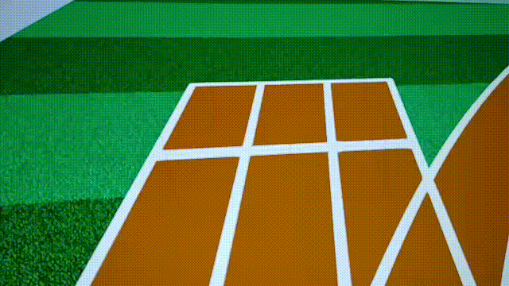
      </td>
      <td width='50%'> <a href='https://openai.com/blog/roboschool/'>Roboschool</a>
      <ul>
        <li>
          Control robots in simulation. 
        </li> 
        <li>
          Can use other physics engines other than MuJoCo.
        </li> 
        <li>
          Alternative to standard OpenAI Gym mujoco environments.
        </li> 
        <li>
          Easy to train multiple agents at once.
        </li> 
      </ul> 
      </td>
    </tr>
    <tr>
      <td width='50%' align='center'>
        
      </td>
      <td width='50%'>
        <a href='https://github.com/rlworkgroup/metaworld'>Meta-World</a> 
        <ul>
          <li>
            50 diverse robot manipulation tasks on a simulated Sawyer robotic arm.
          </li> 
          <li>
            Also includes a variety of evaluation modes varying the number of training and testing tasks.   
          </li> 
        </ul> 
      </td>
    </tr>
    <tr>
      <td width='50%' align='center'>
        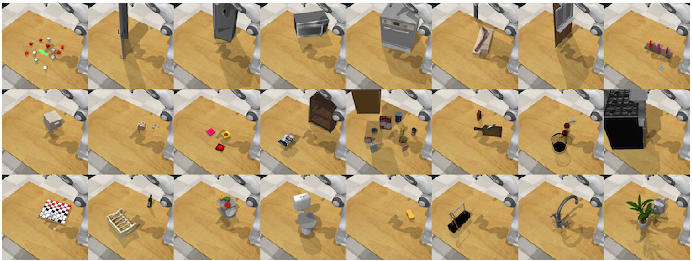
      </td>
      <td width='50%'>
        <a href='https://sites.google.com/view/rlbench'>RLBench</a>
        <ul>
          <li>
            100 unique, hand designed tasks.
          </li> 
          <li>
            Vision-guided manipulation, imitation learning, multi-task
            learning, geometric computer vision and few-shot learning. 
          </li> 
        </ul> 
      </td>
    </tr>
    <tr>
      <td width='50%' align='center'>
        
      </td>
      <td width='50%'>
        <a href='https://www.robonet.wiki'>RoboNet</a>
        <ul>
          <li>
            A dataset for sharing robot experience including actions and frames
            from robots performing various tasks.
          </li> 
          <li>
            15 million video frames from 113 unique camera viewpoints.
          </li> 
          <li>
            7 robot platforms.
          </li> 
        </ul> 
      </td>
    </tr>
    <tr>
      <td width='50%' align='center'>
        
      </td>
      <td width='50%'>
        <a href='https://github.com/Healthcare-Robotics/assistive-gym'> Assistive-gym </a> 
        <ul>
          <li>
           6 assistive tasks (ScratchItch, BedBathing, Feeding, Drinking, Dressing, and ArmManipulation).   
          </li> 
          <li>
           4 commercial robots (PR2, Jaco, Baxter, Sawyer).   
          </li> 
          <li>
            2 human states: static or active (takes actions according to a separate control policy).  
          </li> 
          <li>
           Customizable female and male human models. 40 actuated human joints (head, torso, arms, waist, and legs).Realistic human joint limit.
          </li> 
        </ul> 
      </td>
    </tr>
    <tr>
      <td width='50%' align='center'>
      </td>
      <td width='50%'>
        <a href='https://github.com/tensorflow/datasets/blob/master/tensorflow_datasets/video/bair_robot_pushing.py'>BairPushing Dataset</a>
        <ul>
          <li>
            Dataset of Sawyer pushing objects. 
          </li> 
        </ul> 
      </td>
    </tr>
  </tbody>
</table>

## Games
<table>
  <tbody>
    <tr>
      <td width='50%' align='center'>
        
      </td>
      <td width='50%'>
        <a href='https://github.com/deepmind/pysc2'>StarCraft 2</a>
        <ul>
          <li>
            Provides an interface for RL agents to interact with StarCraft 2,
            getting observations and sending actions.
          </li> 
        </ul> 
      </td>
    </tr>
    <tr>
      <td width='50%' align='center'>
      </td>
      <td width='50%'>
        <a href='https://github.com/TorchCraft/TorchCraft'>TorchCraft</a>
        <ul>
          <li>
            Python interface for playing "StarCraft: Brood War".
          </li> 
        </ul> 
      </td>
    </tr>
    <tr>
      <td width='50%' align='center'>
        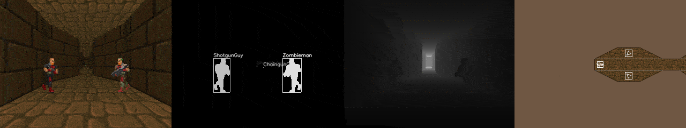
      </td>
      <td width='50%'>
        <a href='https://github.com/mwydmuch/ViZDoom'>VizDoom</a> 
        <ul>
          <li>
            ViZDoom allows developing AI bots that play Doom using only the
            visual information (the screen buffer).
          </li> 
        </ul> 
      </td>
    </tr>
    <tr>
      <td width='50%' align='center'>
        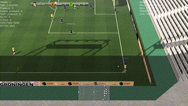
      </td>
      <td width='50%'>
        <a href='https://github.com/google-research/football'>Soccer Simulator</a> 
        <ul>
          <li>
            Can control one or all football players at a time. 
          </li> 
          <li>
            Includes football academy for diverse scenarios such as various
            passing scenarios.
          </li>   
        </ul> 
      </td>
    </tr>
    <tr>
      <td width='50%' align='center'>
        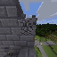
      </td>
      <td width='50%'>
        <a href='https://github.com/minerllabs/minerl'>Minecraft</a> 
        <ul>
          <li>
            Data API for the MineRLv0 dataset.
          </li> 
          <li>
            Also has minecraft environment simulator with basic built in tasks.
          </li> 
        </ul> 
      </td>
    </tr>
    <tr>
      <td width='50%' align='center'>
        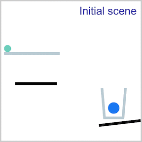
      </td>
      <td width='50%'>
        <a href='https://phyre.ai/'>PHYRE</a> 
        <ul>
          <li>
            Benchmark for physical reasoning that contains a set of simple classical mechanics puzzles in a 2D enviroment. 
          </li> 
        </ul> 
      </td>
    </tr>
    <tr>
      <td width='50%' align='center'>
        
      </td>
      <td width='50%'>
        <a href='https://github.com/crowdAI/marLo'>MarLÖ : Reinforcement Learning + Minecraft</a> 
        <ul>
          <li>
           A high level API built on top of Project MalmÖ to facilitate Reinforcement Learning experiments with a great degree of generalizability, capable of solving problems in pseudo-random, procedurally changing single and multi agent environments within the world of the mediatic phenomenon game Minecraft.   
          </li> 
        </ul> 
      </td>
    </tr>
    <tr>
      <td width='50%' align='center'>
      </td>
      <td width='50%'>
        <a href='https://github.com/ppaquette/gym-super-mario'>SuperMario</a>
        <ul>
          <li>
            Gym wrapper for the Super Mario levels. Includes many levels. 
          </li> 
        </ul> 
      </td>
    </tr>
    <tr>
      <td width='50%' align='center'>
        
      </td>
      <td width='50%'>
        <a href='https://github.com/openai/retro'>Gym Retro</a>
        <ul>
          <li>
            Gym Retro lets you turn classic video games into Gym environments
            for reinforcement learning and comes with integrations for ~1000.
            games.
          </li> 
        </ul> 
      </td>
    </tr>
    <tr>
      <td width='50%' align='center'>
        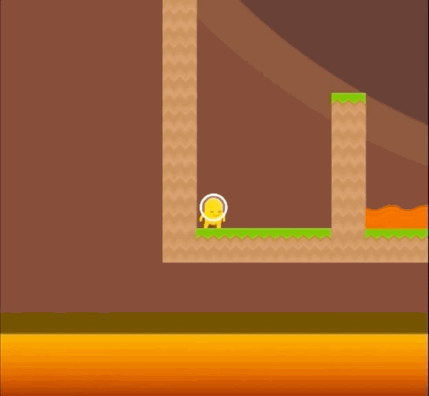
      </td>
      <td width='50%'>
        <a href='https://github.com/openai/coinrun'>Coin-Run</a> 
        <ul>
          <li>
             Training environment which provides a metric for an agent’s
             ability to transfer its experience to novel situations.
          </li> 
        </ul> 
      </td>
    </tr>
  </tbody>
</table>

## Multi-Task Learning
<table>
  <tbody>
    <tr>
      <td width='50%' align='center'>
        
      </td>
      <td width='50%'>
        <a href='https://github.com/rlworkgroup/metaworld'>Meta-World</a> 
        <ul>
          <li>
            50 diverse robot manipulation tasks on a simulated Sawyer robotic arm.
          </li> 
          <li>
            Also includes a variety of evaluation modes varying the number of training and testing tasks.   
          </li> 
        </ul> 
      </td>
    </tr>
    <tr>
      <td width='50%' align='center'>
        
      </td>
      <td width='50%'>
        <a href='https://sites.google.com/view/rlbench'>RLBench</a>
        <ul>
          <li>
            100 unique, hand designed tasks.
          </li> 
          <li>
            Vision-guided manipulation, imitation learning, multi-task
            learning, geometric computer vision and few-shot learning. 
          </li> 
        </ul> 
      </td>
    </tr>
    <tr>
      <td width='50%' align='center'>
        
      </td>
      <td width='50%'> <a href='https://github.com/google-research/google-research/tree/master/playrooms'>Playroom</a>
        <ul>
          <li>
            Variety of tasks in desk scenario. 
          </li> 
          <li>
            Evaluation code and play dataset will be included soon. 
          </li> 
        </ul> 
      </td>
    </tr>
  </tbody>
</table>

## Suites
<table>
  <tbody>
    <tr>
      <td width='50%' align='center'>
        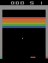
      </td>
      <td>
        <a href='https://gym.openai.com/envs/#atari'>OpenAI Gym Atari</a> 
        <ul>
          <li>
            59 Atari 2600 games.
          </li> 
        </ul> 
      </td>
    </tr>
    <tr>
      <td width='50%' align='center'>
        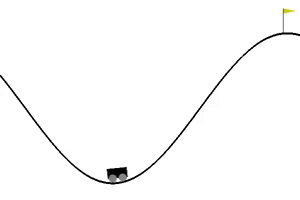
      </td>
      <td>
        <a href='https://gym.openai.com/envs/#classic_control'>OpenAI Gym Classic</a> 
        <ul>
          <li>
            Control theory problems from the classic RL literature.
          </li> 
        </ul> 
      </td>
    </tr>
    <tr>
      <td width='50%' align='center'>
        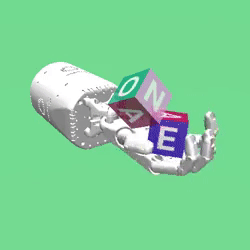
      </td>
      <td>
        <a href='https://gym.openai.com/envs/#robotics'>OpenAI Gym Robotics</a> 
        <ul>
          <li>
            Simulated goal-based tasks for the Fetch and ShadowHand robots.
          </li> 
        </ul> 
      </td>
    </tr>
    <tr>
      <td width='50%' align='center'>
      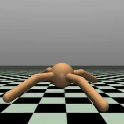
      </td>
      <td>
        <a href='https://gym.openai.com/envs/#mujoco'>OpenAI Gym Mujoco</a> 
        <ul>
          <li>
            Continuous control tasks, running in a fast physics simulator.
          </li> 
        </ul> 
      </td>
    </tr>
    <tr>
      <td width='50%' align='center'>
        
      </td>
      <td>
        <a href='https://github.com/deepmind/dm_control'>DeepMind Control Suite</a> 
        <ul>
          <li>
            A variety of benchmarking continuous control tasks.
          </li> 
        </ul> 
      </td>
    </tr>
    <tr>
      <td width='50%' align='center'>
        
      </td>
      <td>
        <a href='https://github.com/Unity-Technologies/ml-agents/blob/master/docs/Learning-Environment-Examples.md'>Unity Agents</a> 
        <ul>
          <li>
            A number of control tasks in the Unity engine. 
          </li> 
          <li>
            Includes example of parallel learning.
          </li> 
        </ul> 
      </td>
    </tr>
  </tbody>
</table>

## Navigation
<table>
  <tbody>
    <tr>
      <td width='50%' align='center'>
        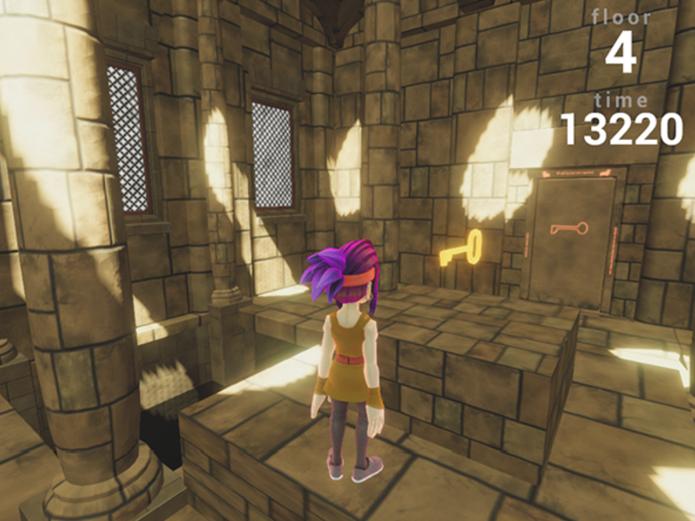
      </td>
      <td>
        <a href='https://github.com/Unity-Technologies/obstacle-tower-challenge'>Obstacle Tower</a> 
        <ul>
          <li>
           Traverse through procedurally generated floors which get progressively harder.   
          </li> 
          <li>
           Challenging visual inputs.    
          </li> 
        </ul> 
      </td>
    </tr>
      <tr>
        <td width='50%' align='center'>
        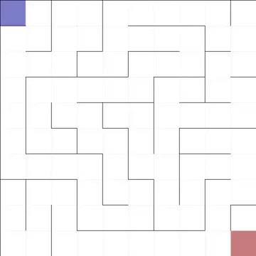
        </td>
        <td>
        <a href='https://github.com/MattChanTK/gym-maze'>gym-maze</a> 
        <ul>
          <li>
            A simple 2D maze environment where an agent (blue dot) finds its
            way from the top left corner (blue square) to the goal at the
            bottom right corner (red square). 
          </li> 
          <li>
            The objective is to find the
            shortest path from the start to the goal.
          </li> 
        </ul> 
        </td>
      </tr>
        <tr>
          <td width='50%' align='center'>
        
          </td>
          <td>
        <a href='https://github.com/maximecb/gym-minigrid'>gym-minigrid</a> 
        <ul>
          <li>
            Lightweight and fast grid world implementation with various
            included tasks.
          </li> 
          <li>
            Easily modifable and extendable.
          </li> 
        </ul> 
          </td>
        </tr>
          <tr>
            <td width='50%' align='center'>
        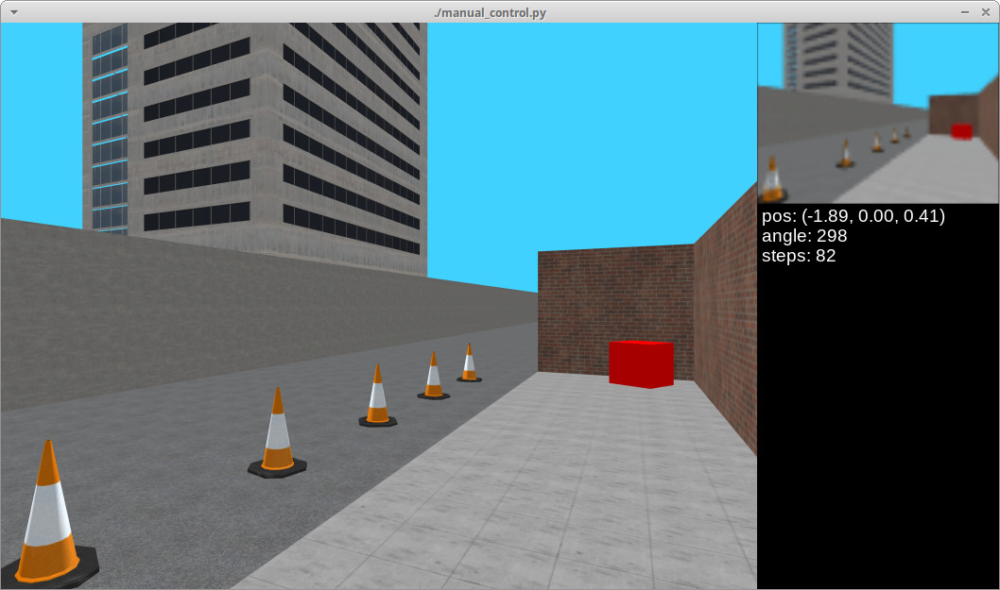
            </td>
            <td>
        <a href='https://github.com/maximecb/gym-miniworld'>gym-miniworld</a> 
        <ul>
          <li>
            Minimalistic 3D interior simulator as an alternative to VizDoom or
            DMLab. 
          </li> 
          <li>
            Easily modifable and extendable.
          </li> 
        </ul> 
            </td>
          </tr>
  </tbody>
</table>

## Home (More Navigation)
<table>
  <tbody>
    <tr>
      <td width='50%' align='center'>
        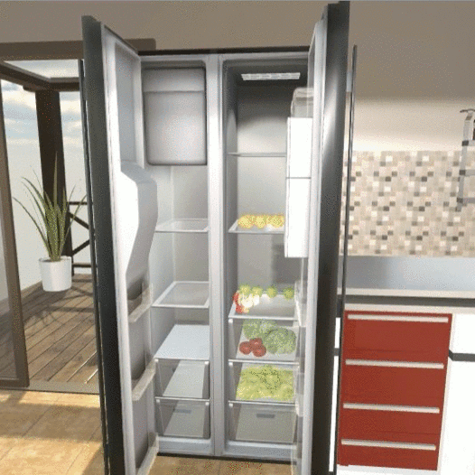
      </td>
      <td>
        <a href='https://ai2thor.allenai.org/'>AI2THOR</a> 
        <ul>
          <li>
            An Interactive 3D Environment for Visual AI 
          </li> 
        </ul> 
      </td>
    </tr>
      <tr>
        <td width='50%' align='center'>
        
        </td>
        <td>
        <a href='https://github.com/facebookresearch/house3d'>House3D</a> 
        <ul>
          <li>
            House3D is a virtual 3D environment which consists of thousands of
            indoor scenes equipped with a diverse set of scene types, layouts
            and objects sourced from the SUNCG dataset
          </li> 
          <li>
            It consists of over 45k indoor 3D scenes, ranging from studios to
            two-storied houses with swimming pools and fitness rooms
          </li> 
          <li>
            All 3D objects are fully annotated with category labels
          </li> 
          <li>
            Multiple observation modalities
          </li> 
          <li>
            Fast rendering at thousands of frames per second
          </li> 
        </ul> 
        </td>
      </tr>
        <tr>
          <td width='50%' align='center'>
        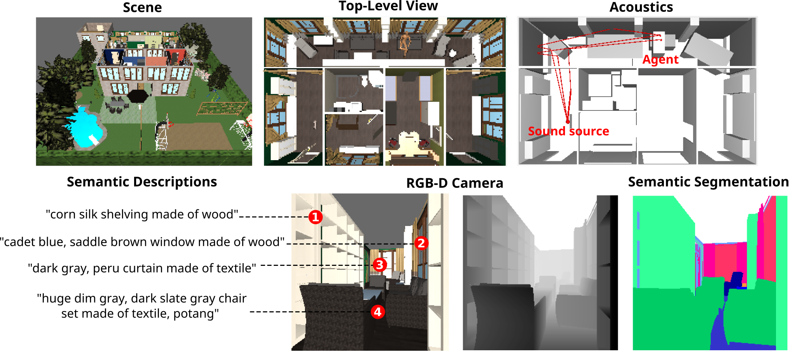
          </td>
          <td>
        <a href='https://github.com/HoME-Platform/home-platform'>HoME: a Household Multimodal Environment</a> 
          <ul>
            <li>
              A platform for agents to learn from vision, audio, semantics, physics, and interaction with objects and other agents, all within a realistic context.      
            </li> 
          </ul> 
          </td>
        </tr>
          <tr>
            <td width='50%' align='center'>
        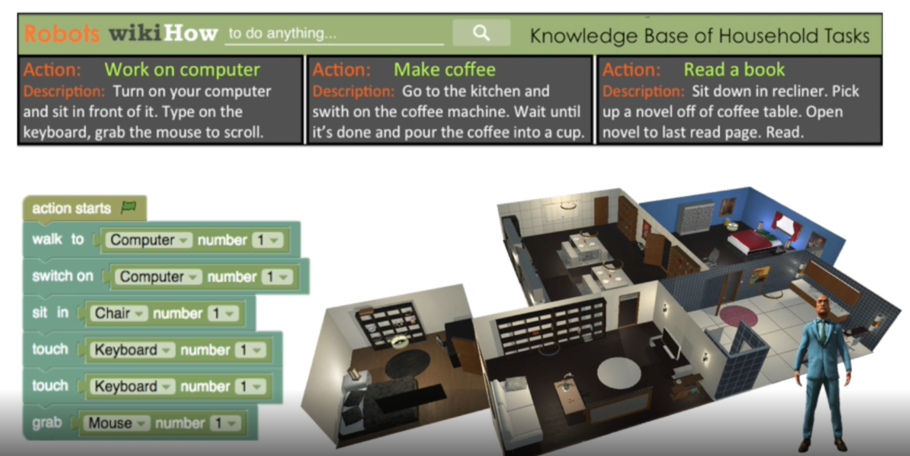
            </td>
            <td>
        <a href='http://virtual-home.org/'>VirtualHome</a> 
        <ul>
          <li>
            A 3D environment allowing to simulate and generate videos of activities as sequences of actions and interaction.
          </li> 
        </ul> 
            </td>
          </tr>
            <tr>
              <td width='50%' align='center'>
        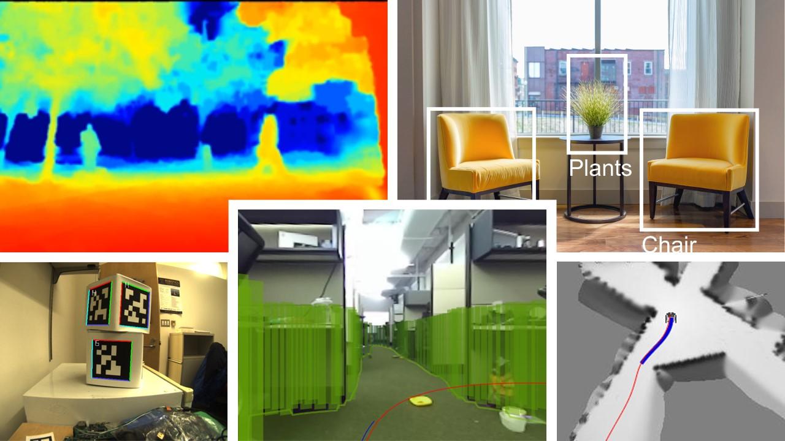
              </td>
              <td>
        <a href='https://developer.nvidia.com/Isaac-sdk'>Nvidia ISAAC simulator</a> 
          <ul>
            <li>
              A virtual robotics laboratory and a high-fidelity 3D world simulator 
            </li> 
          </ul> 
              </td>
            </tr>
              <tr>
                <td width='50%' align='center'>
        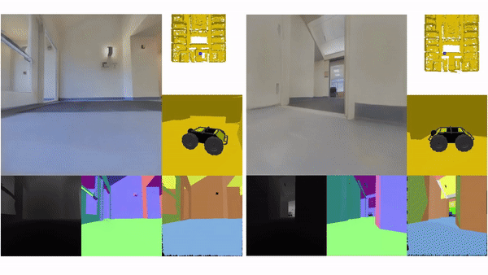
                </td>
                <td>
        <a href='http://gibsonenv.stanford.edu/'>Gibson</a> 
            <ul>
              <li>
                3d navigation in indoor scans 
              </li> 
            </ul> 
                </td>
              </tr>
                <tr>
                  <td width='50%' align='center'>
        
                  </td>
                  <td>
        <a href='https://aihabitat.org'>Habitat</a> 
        <ul>
          <li>
            AI Habitat enables training of embodied AI agents (virtual robots)
            in a highly photorealistic & efficient 3D simulator, before
            transferring the learned skills to reality
          </li> 
        </ul> 
                  </td>
                </tr>
                  <tr>
                    <td width='50%' align='center'>
        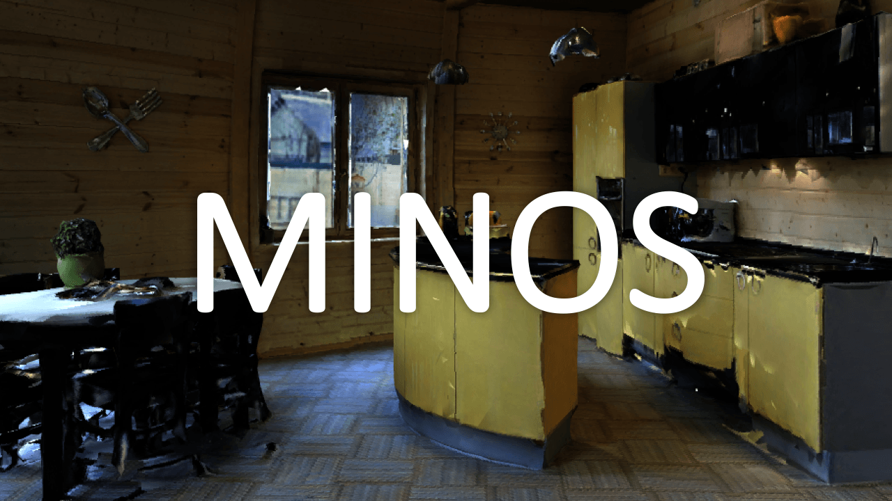
                    </td>
                    <td>
        <a href='https://minosworld.github.io/'>MINOS</a> 
        <ul>
          <li>
            MINOS is a simulator designed to support the development of
            multisensory models for goal-directed navigation in complex indoor
            environments.
          </li> 
          <li>
            MINOS leverages large datasets of complex 3D environments and
            supports flexible configuration of multimodal sensor suites.
          </li> 
        </ul> 
                    </td>
                  </tr>
  </tbody>
</table>

## Multi-Agent
<table>
  <tbody>
    <tr>
      <td width='50%' align='center'>
        
      </td>
      <td>
        <a href='https://github.com/openai/robosumo'>RoboSumo</a> 
        <ul>
          <li>
            Sumo-wrestling between two ants using continuous control.
          </li> 
        </ul> 
      </td>
    </tr>
    <tr>
      <td width='50%' align='center'>
        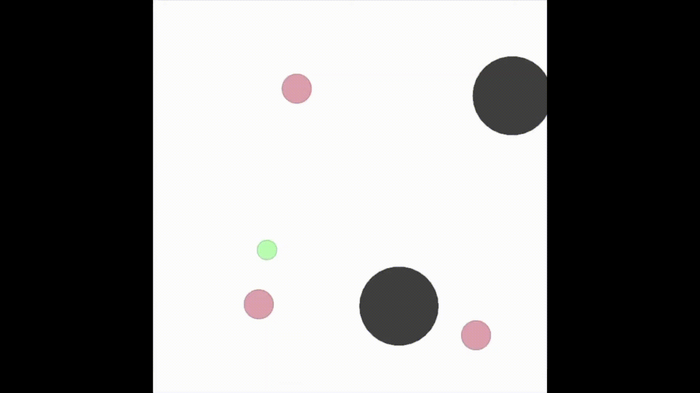
      </td>
      <td width='50%'>
        <a href='https://github.com/openai/multiagent-particle-envs'>Multi-agent Particle Environment</a>
        <ul>
          <li>
         A simple multi-agent particle world with a continuous observation and discrete action space, along with some basic simulated physics
          </li> 
        </ul> 
      </td>
    </tr>
      <tr>
        <td width='50%' align='center'>
        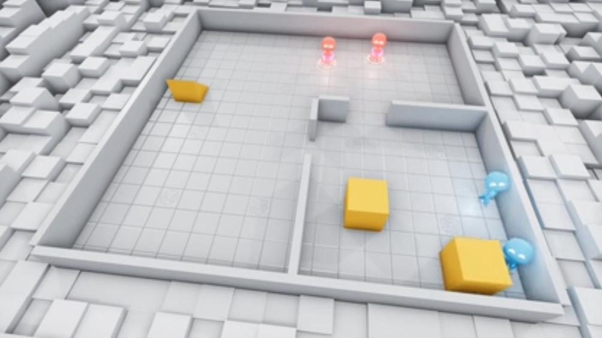
        </td>
        <td>
        <a href='https://github.com/openai/multi-agent-emergence-environments'>OpenAI Multi-Agent Hide and Seek</a> 
        <ul>
          <li>
            A team of seekers and a team of hiders. 
          </li> 
          <li>
            Both teams can use tools to achieve their objective.
          </li> 
        </ul> 
        </td>
      </tr>
        <tr>
          <td width='50%' align='center'>
        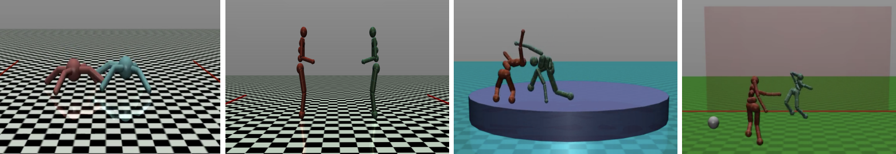
          </td>
          <td>
        <a href='https://github.com/openai/multiagent-competition'>OpenAI Multi-Agent Competition Environments</a> 
        <ul>
          <li>
            Contains many continous control, multi-agent tasks.
          </li> 
        </ul> 
          </td>
        </tr>
          <tr>
            <td width='50%' align='center'>
        
            </td>
            <td>
        <a href='https://github.com/openai/neural-mmo'>Massive Multi Agent Game Environment</a> 
        <ul>
          <li>
            We consider MMORPGs (Massive
            Multiplayer Online Role Playing Games) the best proxy for the real
            world among human games: they are complete macrocosms featuring
            thousands of agents per persistent world, diverse skilling systems,
            global economies, complex emergent social structures, and ad-hoc
            high stakes single and team based conflict.
          </li> 
        </ul> 
            </td>
          </tr>
  </tbody>
</table>

## Safety
<table>
  <tbody>
    <tr>
      <td width='50%' align='center'>
        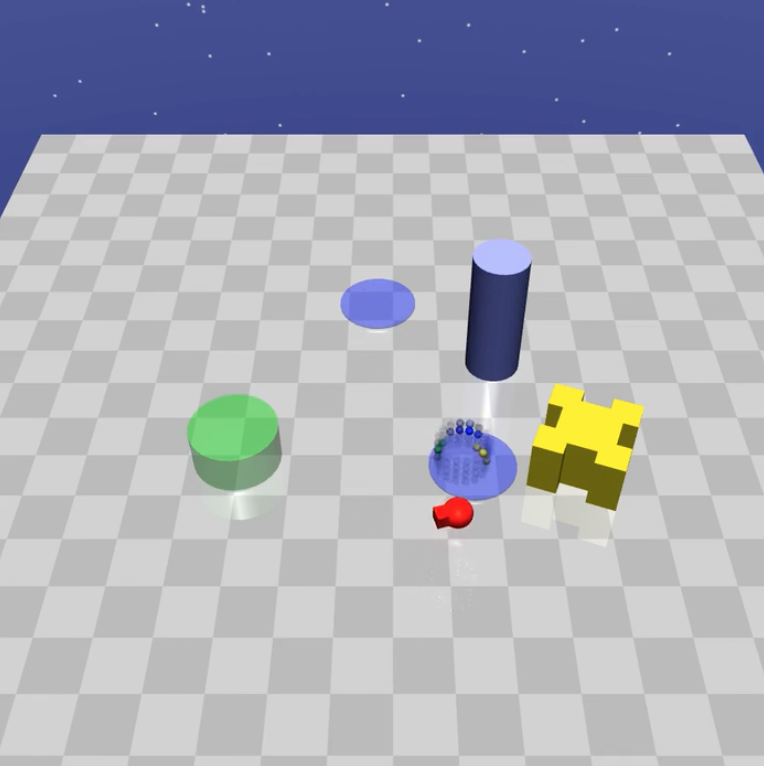
      </td>
      <td>
        <a href='https://github.com/openai/safety-gym'>Safety Gym</a> 
        <ul>
          <li>
            Tools for accelerating safe exploration research.
          </li> 
        </ul> 
      </td>
    </tr>
   <tr>
      <td width='50%' align='center'>
        
      </td>
      <td width='50%'>
        <a href='https://github.com/Healthcare-Robotics/assistive-gym'> Assistive-gym </a> 
        <ul>
          <li>
           6 assistive tasks (ScratchItch, BedBathing, Feeding, Drinking, Dressing, and ArmManipulation).   
          </li> 
          <li>
           4 commercial robots (PR2, Jaco, Baxter, Sawyer).   
          </li> 
          <li>
            2 human states: static or active (takes actions according to a separate control policy).  
          </li> 
          <li>
           Customizable female and male human models. 40 actuated human joints (head, torso, arms, waist, and legs).Realistic human joint limit.
          </li> 
        </ul> 
      </td>
    </tr>     
      <tr>
        <td width='50%' align='center'>
        </td>
        <td width='50%'>
        <a href='https://github.com/deepmind/ai-safety-gridworlds'>DeepMind AI Safety Gridworlds </a>
        <ul>
          <li>
            This is a suite of reinforcement learning environments illustrating
            various safety properties of intelligent agents.
          </li> 
        </ul> 
        </td>
      </tr>
  </tbody>
</table>

## Autonomous Driving
<table>
  <tbody>
  <tr>
    <td width='50%' align='center'>
      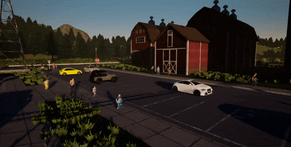
    </td>
    <td width='50%'>
      <a href='http://carla.org/'>CARLA</a> 
      <ul>
        <li>
          CARLA has been developed from the ground up to support development,
          training, and validation of autonomous driving systems
        </li> 
      </ul> 
    </td>
  </tr>
  <tr>
    <td width='50%' align='center'>
      
    </td>
    <td width='50%'>
      <a href='https://github.com/Microsoft/AirSim'>Autonomous Vehicle Simulator</a> 
      <ul>
        <li>
          Open source simulator for autonomous vehicles built on Unreal Engine
          / Unity, from Microsoft AI & Research
        </li> 
      </ul> 
    </td>
  </tr>
  <tr>
    <td width='50%' align='center'>
      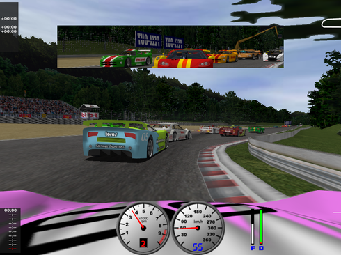
    </td>
    <td width='50%'>
      <a href='https://sourceforge.net/projects/torcs/'>TORCS</a> 
      <ul>
        <li>
          TORCS, The Open Racing Car Simulator is a highly portable multi
          platform car racing simulation
        </li> 
        <li>
          Many tracks, opponents and cars available
        </li> 
        <li>
          Easy to modify
        </li> 
      </ul> 
    </td>
  </tr>
  <tr>
    <td width='50%' align='center'>
      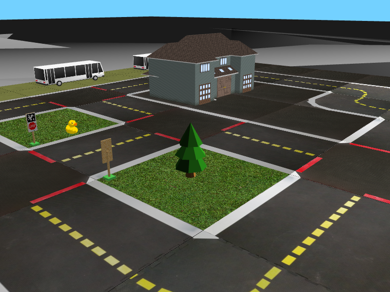
    </td>
    <td width='50%'>
      <a href='https://github.com/duckietown/gym-duckietown'>DuckieTown</a> 
      <ul>
        <li>
          Self-driving car simulator for the Duckietown universe.
        </li> 
      </ul> 
    </td>
  </tr>
  <tr>
    <td width='50%' align='center'>
      
    </td>
    <td width='50%'>
      <a href='https://github.com/deepdrive/deepdrive'>DeepDrive Self Driving Car Simulator</a> 
      <ul>
        <li>
          End-to-end simulation for self-driving cars 
        </li> 
      </ul> 
    </td>
  </tr>
  <tr>
    <td width='50%' align='center'>
      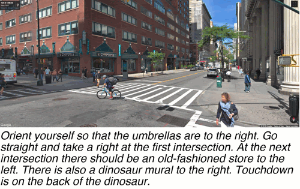
    </td>
    <td width='50%'>
      <a href='https://github.com/deepmind/streetlearn'>DeepMind StreetLearn</a> 
      <ul>
        <li>
          A C++/Python implementation of the StreetLearn environment based on
          images from Street View, as well as a TensorFlow implementation of
          goal-driven navigation agents solving the task published in “Learning
          to Navigate in Cities Without a Map”, NeurIPS 2018
        </li> 
      </ul> 
    </td>
  </tr>
  <tr>
    <td width='50%' align='center'>
      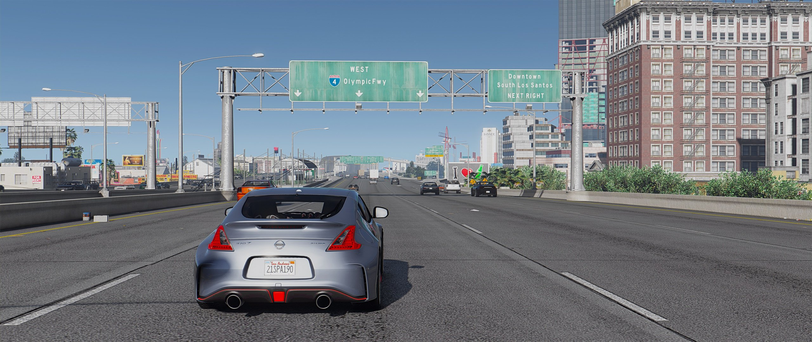
    </td>
    <td width='50%'>
      <a href='https://github.com/aitorzip/DeepGTAV'>DeepGTAV v2</a> 
      <ul>
        <li>
          A plugin for GTAV that transforms it into a vision-based self-driving
          car research environment.
        </li> 
      </ul> 
    </td>
  </tr>
  <tr>
    <td width='50%' align='center'>
      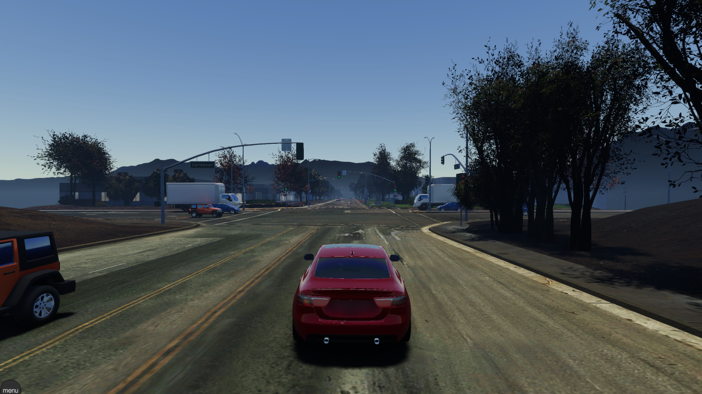
    </td>
    <td width='50%'>
      <a href='https://www.lgsvlsimulator.com/'>LGSVL</a> 
      <ul>
        <li>
          Simulation software to accelerate safe autonomous vehicle development
        </li> 
      </ul> 
    </td>
  </tr>
  </tbody>
</table>

## Humanoid
<table>
  <tbody>
    <tr>
      <td width='50%' align='center'>
        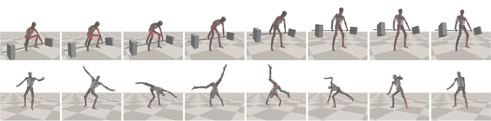
      </td>
      <td>
        <a href='https://github.com/lsw9021/MASS'>Full Body Muscle Simulator</a> 
        <ul>
          <li>
            A basic simulation and control for full-body Musculoskeletal system
          </li> 
        </ul> 
      </td>
    </tr>
      <tr>
        <td width='50%' align='center'>
        
        </td>
        <td>
        <a href='http://osim-rl.stanford.edu/'>Osim-rl</a> 
        <ul>
          <li>
            Reinforcement learning environments with musculoskeletal models. Task: learning to walk/move/run using musculoskeletal models. 
          </li> 
        </ul> 
        </td>
      </tr>
    <tr>
      <td width='50%' align='center'>
        
      </td>
      <td width='50%'> <a href='https://openai.com/blog/roboschool/'>Roboschool</a>
      <ul>
        <li>
          Control robots in simulation. 
        </li> 
        <li>
          Can use other physics engines other than MuJoCo.
        </li> 
        <li>
          Alternative to standard OpenAI Gym mujoco environments.
        </li> 
        <li>
          Easy to train multiple agents at once.
        </li> 
      </ul> 
      </td>
    </tr>
  </tbody>
</table>

## Text
<table>
  <tbody>
    <tr>
      <td width='50%' align='center'>
        
      </td>
      <td width='50%'>
        <a href='https://github.com/microsoft/jericho'>Jericho</a> 
        <ul>
          <li>
            A learning environment for man-made Interactive Fiction games.
          </li> 
        </ul> 
      </td>
    </tr>
  </tbody>
</table>

## Misc
<table>
  <tbody>
  <tr>
    <td width='50%' align='center'>
    </td>
    <td width='50%'>
        <a href='https://github.com/criteo-research/reco-gym'>Reco Gym</a> 
        <ul>
          <li>
              Reinforcement Learning Environment for the problem of Product Recommendation in Online Advertising.
          </li> 
        </ul> 
    </td>
  </tr>
  </tbody>
</table>

## Physics Simulators

* <a href='https://github.com/openai/mujoco-py'>Mujoco-py</a>
* <a href='https://pybullet.org/wordpress/'>PyBullet</a>
* <a href='http://dartsim.github.io'>DART</a>
* <a href='http://www.coppeliarobotics.com/'>V-REP</a>

