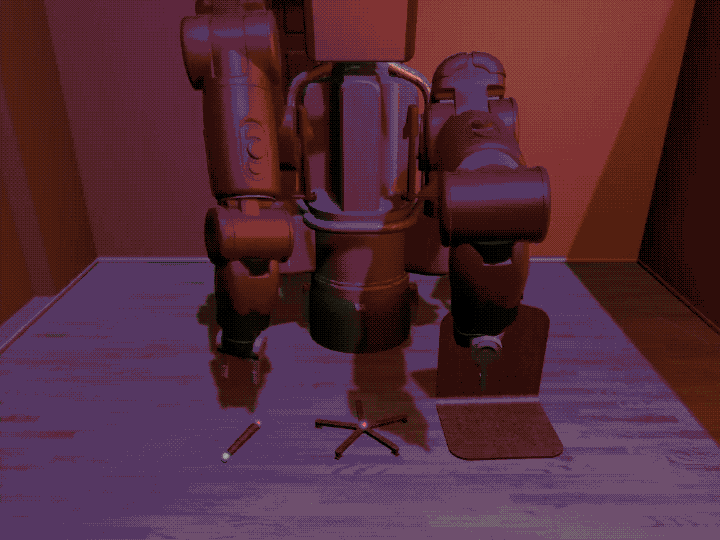

RL environment list
===================

A comprehensive list of environments for reinforcement learning categorized by
use. If there is an environment you think is missing, please submit a form
[here](https://github.com/clvrai/awesome-rl-envs/issues).

Each environment has a teaser figure next to it. Note all the teaser figures may take some
time to load.

Table of Contents
=================
* [Robotics](#robotics)
* [Games](#games)
* [Multi-Task Learning](#multi-task-learning)
* [Suites](#suites)
* [Navigation](#navigation)
* [Home (More Navigation)](#home-more-navigation)
* [Multi-Agent](#multi-agent)
* [Safety](#safety)
* [Autonomous Driving](#autonomous-driving)
* [Humanoid](#humanoid)
* [Text](#text)
* [Physics Simulators](#physics-simulators)
* [Misc](#misc)

## Robotics

|   |   |
| :---: | --- |
|  | [IKEA Furniture Assembly](https://clvrai.github.io/furniture/) for testing and accelerating the automation of complex long-horizon manipulation tasks including 80+ furniture models, 3 robots (Baxter, Sawyer, Cursor), and configurable backgrounds and textures. |
|  | [DoorGym](https://github.com/PSVL/DoorGym) |
|  | [Playroom](https://github.com/google-research/google-research/tree/master/playrooms) |
|  | [Robosuite](https://github.com/StanfordVL/robosuite) |
|  | [Roboschool](https://openai.com/blog/roboschool/) |
|  | [Meta-World](https://github.com/rlworkgroup/metaworld) Includes 50 diverse robot manipulation tasks on a simulated Sawyer robotic arm. Also includes a variety of evaluation modes varying the number of training and testing tasks.   |
|  | [RLBench](https://sites.google.com/view/rlbench) |
|  | [RoboNet](https://www.robonet.wiki) |
|  | [Assistive-gym](https://github.com/Healthcare-Robotics/assistive-gym) 6 assistive tasks (ScratchItch, BedBathing, Feeding, Drinking, Dressing, and ArmManipulation).4 commercial robots (PR2, Jaco, Baxter, Sawyer). 2 human states: static or active (takes actions according to a separate control policy).Customizable female and male human models. 40 actuated human joints (head, torso, arms, waist, and legs).Realistic human joint limits|
| | [BairPushing Dataset](https://github.com/tensorflow/datasets/blob/master/tensorflow_datasets/video/bair_robot_pushing.py) |

## Games
|   |  |
| :---: | --- |
|  | [StarCraft 2](https://github.com/deepmind/pysc2) |
| | [TorchCraft](https://github.com/TorchCraft/TorchCraft) |
|  | [VizDoom](https://github.com/mwydmuch/ViZDoom) |
|  | [Soccer Simulator](https://github.com/google-research/football) |
|  | [Minecraft](https://github.com/minerllabs/minerl) |
|  | [PHYRE](https://phyre.ai/) Benchmark for physical reasoning that contains a set of simple classical mechanics puzzles in a 2D enviroment | 
|  | [MarLÖ : Reinforcement Learning + Minecraft](https://github.com/crowdAI/marLo) A high level API built on top of Project MalmÖ to facilitate Reinforcement Learning experiments with a great degree of generalizability, capable of solving problems in pseudo-random, procedurally changing single and multi agent environments within the world of the mediatic phenomenon game Minecraft. |
| | [SuperMario](https://github.com/ppaquette/gym-super-mario) |
|  | [Gym Retro](https://github.com/openai/retro) |
|  | [Coin-Run](https://github.com/openai/coinrun) |

## Multi-Task Learning
|   |   |
| :---: | --- |
|  | [Meta-World](https://github.com/rlworkgroup/metaworld) Includes 50 diverse robot manipulation tasks on a simulated Sawyer robotic arm. Also includes a variety of evaluation modes varying the number of training and testing tasks.   |
|  | [RLBench](https://sites.google.com/view/rlbench) |
|  | [Playroom](https://github.com/google-research/google-research/tree/master/playrooms) |

## Suites
|   |   |
| :---: | --- |
|  | [OpenAI Gym Robotics](https://github.com/openai/gym) | 
|  | [OpenAI Gym Mujoco](https://github.com/openai/gym) | 
|  | [OpenAI Gym Classic](https://github.com/openai/gym) | 
|  | [OpenAI Gym Atari](https://github.com/openai/gym) | 
|  | [DeepMind Control Suite](https://github.com/openai/gy://github.com/deepmind/dm_control) | 
|  | [Unity Agents](https://github.com/Unity-Technologies/ml-agents/blob/master/docs/Learning-Environment-Examples.md) |

## Navigation
|   |   |
| :---: | --- |
|  | [Obstacle Tower](https://github.com/Unity-Technologies/obstacle-tower-challenge) Traverse through procedurally generated floors which get progressively harder. Challenging visual inputs. |
|  | [gym-maze](https://github.com/MattChanTK/gym-maze) |
|  | [gym-minigrid](https://github.com/maximecb/gym-minigrid) |
|  | [gym-miniworld](https://github.com/maximecb/gym-miniworld) |

## Home (More Navigation)
|   |   |
| :---: | --- |
|  | [AI2THOR](https://ai2thor.allenai.org/) An Interactive 3D Environment for Visual AI |
|  | [House3D](https://github.com/facebookresearch/house3d) |
|  | [HoME: a Household Multimodal Environment](https://github.com/HoME-Platform/home-platform) platform for agents to learn from vision, audio, semantics, physics, and interaction with objects and other agents, all within a realistic context.|
|  | [VirtualHome](http://virtual-home.org/) |
|  | [Nvidia ISAAC simulator](https://developer.nvidia.com/Isaac-sdk) virtual robotics laboratory and a high-fidelity 3D world simulator |
|  | [Gibson](http://gibsonenv.stanford.edu/) 3d navigation in indoor scans |
|  | [Habitat](https://aihabitat.org) |
|  | [MINOS](https://minosworld.github.io/) |

## Multi-Agent
|   |   |
| :---: | --- |
|  | [RoboSumo](https://github.com/openai/robosumo) |
|  | [Multi-agent Particle Environment](https://github.com/openai/multiagent-particle-envs) A simple multi-agent particle world with a continuous observation and discrete action space, along with some basic simulated physics.|
|  | [OpenAI Multi-Agent Hide and Seek](https://github.com/openai/multi-agent-emergence-environments) |
|  | [OpenAI Multi-Agent Competition Environments](https://github.com/openai/multiagent-competition) |
|  | [Massive Multi Agent Game Environment](https://github.com/openai/neural-mmo) |

## Safety
|   |   |
| :---: | --- |
|   | [Safety Gym](https://github.com/openai/safety-gym) |
|  | [Assistive-gym](https://github.com/Healthcare-Robotics/assistive-gym) 6 assistive tasks (ScratchItch, BedBathing, Feeding, Drinking, Dressing, and ArmManipulation).4 commercial robots (PR2, Jaco, Baxter, Sawyer). 2 human states: static or active (takes actions according to a separate control policy).Customizable female and male human models. 40 actuated human joints (head, torso, arms, waist, and legs).Realistic human joint limits|
| | [DeepMind AI Safety Gridworlds ](https://github.com/deepmind/ai-safety-gridworlds) |

## Autonomous Driving
|   |   |
| :---: | --- |
|  | [DuckieTown](https://github.com/duckietown/gym-duckietown) |
|  | [Autonomous Vehicle Simulator](https://github.com/Microsoft/AirSim) |
|  | [DeepDrive Self Driving Car Simulator](https://github.com/deepdrive/deepdrive) |
|  | [DeepMind StreetLearn](https://github.com/deepmind/streetlearn) |
|  | [DeepGTAV v2](https://github.com/aitorzip/DeepGTAV) |
|  | [TORCS](https://sourceforge.net/projects/torcs/) |
|  | [CARLA](http://carla.org/) |
|  | [LGSVL](https://www.lgsvlsimulator.com/) |

## Humanoid
|   |   |
| :---: | --- |
|  | [Full Body Muscle Simulator](https://github.com/lsw9021/MASS) |
|  | [Osim-rl](http://osim-rl.stanford.edu/) Reinforcement learning environments with musculoskeletal models. Task: learning to walk/move/run using musculoskeletal models. |
|  | [Roboschool](https://openai.com/blog/roboschool/) |

## Text
|   |   |
| :---: | --- |
|  | [Jericho](https://github.com/microsoft/jericho) |

## Physics Simulators
|   |   |
| :---: | --- |
| | [Mujoco-py](https://github.com/openai/mujoco-py) |
| | [PyBullet](https://pybullet.org/wordpress/) |
| | [DART](http://dartsim.github.io) |

## Misc
|   |   |
| :---: | --- |
| | [Reco Gym](https://github.com/criteo-research/reco-gym) Reinforcement Learning Environment for the problem of Product Recommendation in Online Advertising. |

